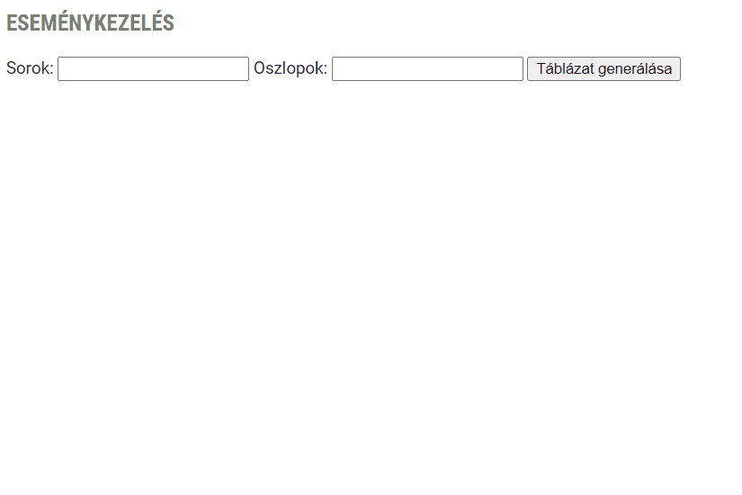

# JS CSOPORTZH 2022-1

## Képszerkesztés dolgozat
 A `script.js` fájl első sorában található tömb tartalmazza egy valós csoport átlagpontszámát egy képszerkesztés dolgozatnál. Oldd meg az alábbi feladatokat, lehetőség szerint tömbfüggvénnyel, és fűzd hozzá a végeredményeket megfelelő helyre.

 1. Az ötöst 24 pont felett lehetett megkapni. Hány darab ötös dolgozat volt? `1 pont`
 2. Mennyi volt a csoport átlaga? `2 pont`
 3. Elégtelen érdemjegyet 10 pont alatt lehetett kapni. Volt-e a dolgozatok között, aki elégtelen érdemjegyet kapott? Ha igen, akkor írasd ki, hogy "Igen, volt.", ha nem, akkor azt, hogy "Nem, nem volt.". `2 pont`
 4. Az a tanuló, aki megcsinálta és feltöltötte a gyakorlófeladatot, plusz 3 pontot kaphatott a dolgozatnál, és ezzel a lehetőséggel mindenki élt. Rendeld hozzá minden tanulóhoz a +3 pontot, és írasd ki **Console**-ra az újonnan kapott tömböt.`1 pont`

 ## Táblázat

1. Az gombra kattintáskor generáljon le egy táblázatot a megadott sor és oszlopszámmal a `table` tag-be! `3 pont`
2. Az cellákat töltse fel a cellájuk index-ével. (Akár egy counter változóval megoldható) `1 pont`
3. Tudjunk kijelölni két számot a táblázatunkban kattintással. A kijelölt számok hátterét változtassuk meg egy tetszőleges színre. `2 pont`
4. A két kiválasztott cella `innerHTML`-ét mentse el változó(k)ba vagy listába, majd a `kiiras` id-jú írjuk ki a két szám szorzatát, például `7 * 8 = 56`! `2 pont`
5. Két szám kiválasztása és kiíratása után állítsuk vissza a cellahátterek színét az eredeti színre. Az alábbi parancsokat is használhatod hozzá: `document.querySelectorAll()`, `ForEach`, `background-color: unset`! `2 pont`

Összpontszám: `15 pont` *(viszont a dolgozaton összesen 10 pontot lehet maximum gyűjteni)*

